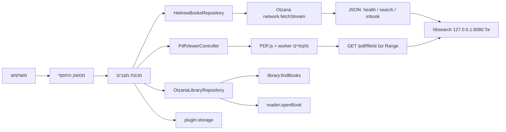

# אפיון מימוש: תוסף HebrewBooks לאוצריא

> סטטוס: מסמך תכנון, ללא קוד מימוש  
> תאריך: 21 ביולי 2026  
> יעד ראשון: Windows, אוצריא `0.9.97` ומעלה, Plugin SDK `1.x`
> שרת שנבדק: `hbsearch` גרסה `3.0.114-beta2+6a3f99162c4be6b1dc5b054a4883dccb1690830f` (`FileVersion 3.0.114.0`)  
> SHA-256: `142097A91C855F9C4858624C1D76D02BACEEEDBC806449D88ED00CB3CCA19AE7`; בבינארי אחר יש להריץ מחדש את בדיקות החוזה
> הוכחת היתכנות שנבדקה: `com.chadbedera.pdfviewer` גרסה `2.0.5`

## 1. החלטה אדריכלית

התוסף יהיה לקוח WebView ממוקד עם קורא PDF פנימי. הוא **לא** יריץ תהליך, לא יקרא אינדקסים ולא יקבל נתיבי קבצים. חיפוש ונתוני JSON יעברו דרך `network.fetchStream` של אוצריא אל שירות `hbsearch` מקומי; PDF יוצג בתוך התוסף באמצעות PDF.js ארוז מקומית, שיקרא טווחי בתים מ־endpoint מקומי ומוגן לפי `fileId`.

גרסה 1 תתמוך בשרת שרץ באותו מחשב בלבד, בכתובת קבועה:

`http://127.0.0.1:8080`

הפעולה הראשית עבור תוצאת `PDF` תהיה פתיחה בקורא הפנימי של התוסף, גם אם הספר אינו רשום בספריית אוצריא. הזרימה תהיה:

1. לקרוא ל־`/inbook` ולקבל את עמודי ההתאמה.
2. לפתוח את `GET /pdf/<fileId>` ב־PDF.js ולקפוץ לעמוד הראשון שנמצא.
3. להציע כפעולות משניות פתיחה בקורא המובנה של אוצריא, אם נמצאה התאמה בטוחה, או פתיחה באתר HebrewBooks.

הבינארי הנוכחי אינו כולל endpoint שמגיש PDF, ולכן נדרשת הרחבת שרת קטנה לפני שניתן להשלים יכולת זו. אין לעקוף זאת באמצעות `file://`, קריאת Registry או הרצת `hbsearch.exe` מ־JavaScript. ההרחבה תקבל מזהה אטום בלבד ותפתור את הנתיב בצד השרת.

## 2. מטרות

### 2.1 מטרות גרסה 1

- חיפוש מהיר בתוכן ספריית HebrewBooks מתוך לשונית "כלים" באוצריא.
- תמיכה באפשרויות החיפוש שבאמת זמינות ב־HTTP של `hbsearch`.
- הצגת תוצאות נקייה: שם ספר, מחבר, מקום ושנת דפוס, מספר מופעים וסוג מקור.
- איתור עמודי התוצאות בתוך PDF לפי דרישה, בלי לבצע בקשת פרטים לכל תוצאה מראש.
- פתיחת כל PDF מקומי תקין ולא מוצפן של HebrewBooks בתוך לשונית התוסף, בלי תלות בספריית אוצריא.
- טעינת PDF באמצעות HTTP Range וקפיצה לעמוד ההתאמה בלי לקרוא את כל הקובץ לזיכרון.
- הדגשת מונחים כאשר קיימת שכבת טקסט מתאימה; כאשר אינה קיימת, הצגת עמודי ההתאמה בלי להמציא הדגשה.
- פתיחה אופציונלית בקורא המובנה של אוצריא כאשר נמצא ספר תואם.
- טיפול ברור במצב שבו השירות אינו מותקן, אינו רץ, חסום או אינו תואם.
- ממשק RTL מלא, נגיש, תואם ערכת נושא וגודל גופן של אוצריא.
- צריכת זיכרון ורשת מוגבלת וצפויה.

### 2.2 מחוץ לתחום גרסה 1

- התקנת `hbsearch.exe` מתוך התוסף עצמו.
- הפעלה או עצירה של תהליך Windows מתוך התוסף.
- פתיחת נתיב קובץ שרירותי שלא נבחר בידי המשתמש ולא נפתר לפי `fileId` בשרת.
- הבטחה שכל PDF ייפתח דווקא בקורא המובנה של אוצריא; הקורא הפנימי הוא הנתיב הנתמך.
- OCR בתוך התוסף; הוא אינו דרוש לחיפוש הקיים ויגדיל מאוד את החבילה.
- הצגת קטעי טקסט (snippets); השרת הקיים אינו מחזיר אותם ב־`/search`.
- חיפוש תוך כדי הקלדה.
- ריצה ברקע עם `app.run_on_startup`.
- תמיכה כללית בשרת בעל כתובת LAN משתנה.
- שינוי קוד אוצריא. הרחבת שרת `hbsearch` כן נדרשת, אך היא מופצת ברכיב הנלווה ולא בתוך `.otzplugin`.

## 3. מקורות האמת

במקרה של סתירה, סדר העדיפות הוא:

1. ההתנהגות בפועל של הבינארי שנבדק ב־`hbsearch-min`.
2. `docs/plugin-sdk/API_REFERENCE.md` בפרויקט אוצריא.
3. `docs/plugin-sdk/README.md`, `DESIGN_GUIDE.md` ו־`COOKBOOK.md`.
4. תוסף הייחוס `com.chadbedera.pdfviewer-2.0.5` כהוכחה ליכולת WebView/PDF.js, לא כתבנית ארכיטקטונית.
5. הפוסטים והרעיונות הראשוניים.

הסיבה לסדר הזה: מסך העזרה של `hbsearch` אינו מתעד את כל הנתיבים, והפוסט מתאר חוזה חלקי וישן יותר.

## 4. עובדות שאומתו

### 4.1 מגבלות אוצריא

- תוסף הוא HTML/CSS/JS בתוך WebView מוגן.
- אין לתוסף גישה חופשית למערכת הקבצים או להרצת תוכנות.
- גישה ל־loopback דורשת `network.localhost`, `network.enabled: true` וכתובת תואמת ב־allowlist של המניפסט.
- קריאות HTTP צריכות לעבור דרך `Otzaria.call('network.fetchStream', ...)`.
- `network.fetchStream` מחזיר metadata ולאחריו מקטעי UTF-8; החיפוש מפענח NDJSON שורה אחר שורה.
- בקשות HTTP ישירות של משאבי WebView נבדקות גם הן מול `network.enabled`, הרשאת הרשת וה־allowlist. לכן PDF.js יכול לקרוא URL מאושר ב־loopback, בתנאי שהשרת מחזיר CORS מתאים.
- בחיפוש מוגדר `timeoutMs: 120000`; יציאה מה־iterator מבטלת את הבקשה.
- `reader.openBook` מחפש ספר בספריית אוצריא לפי `bookId`, שבמימוש הנוכחי הוא למעשה כותרת הספר.
- `library.findBooks` מחזיר בפועל `bookId` ו־`title` בלבד. אין להסתמך על `author` או `type` בתשובה זו.
- אין להשתמש ב־`library.getTree` לצורך כל לחיצה על תוצאה: העץ המלא עלול להיות גדול מאוד.

### 4.2 חוזה שרת החיפוש הקיים

השרת מאזין כרגע על `http://+:<port>/`, ולא רק על loopback. הוא מבצע חיפוש אחד בכל פעם באמצעות נעילה פנימית.

| נתיב | Method | שימוש בתוסף | פורמט הצלחה |
|---|---|---|---|
| `/health` | GET | בדיקת זמינות | JSON יחיד |
| `/search` | POST | חיפוש ספרים | NDJSON, אובייקט אחד בכל שורה |
| `/inbook` | POST | עמודים ומונחי התאמה בספר אחד | JSON יחיד |

אין בבינארי שנבדק נתיב שמגיש PDF. כל נתיב שאינו הנתיבים המפורשים לעיל ונתיבי ההתקנה מחזיר 404. לכן `GET /pdf/<fileId>` שמוגדר בהמשך הוא שינוי נדרש בשרת, לא יכולת שכבר קיימת.

תשובת health שנבדקה:

```json
{"ok":true,"service":"hbsearch"}
```

שגיאת HTTP שמוחזרת במסלולים המתועדים היא בדרך כלל:

```json
{"ok":false,"error":"תיאור השגיאה"}
```

אין כיום `apiVersion` או רשימת capabilities ב־`/health`; לכן בדיקת התאימות בגרסה 1 תהיה בדיקת מבנה שמרנית ולא השוואת גרסאות אמיתית.

### 4.3 פערים חשובים בין CLI ל־HTTP

- `--weak` קיים ב־CLI, אבל אינו קיים במודל בקשת `/search` ואינו נקרא מפרמטרי GET. אין להציג אפשרות זו בגרסה 1.
- `/search` מחזיר תמיד NDJSON. הדגל `--format json` רלוונטי למצב CLI בלבד.
- מעטפת ה־CLI (`query`, `transformedQuery`, `totalMatched`, `returned`, `results`) אינה קיימת ב־HTTP.
- השדה `firstHitPage` קיים בכל שורת תוצאה, אך בגרסה שנבדקה הוא נבנה תמיד כ־`null`. אין להסתמך עליו.
- `/inbook` אינו תומך ב־`firstWord`, `lastWord` או `weak`. כאשר אחד משני דגלי העיגון פעיל, אין להציג את העמוד שמחזיר `/inbook` כ"מיקום מדויק".
- `/inbook` מחזיר גם `highlightXml`, אף שהתוסף אינו זקוק לו. יש למחוק את המחרוזת מהמודל מיד לאחר פענוח התשובה ולא לשמור אותה.

### 4.4 מה מוכיח תוסף PDFViewer

בתוסף `com.chadbedera.pdfviewer` גרסה `2.0.5` נבדקה הזרימה הבאה:

1. המשתמש בוחר קובץ באמצעות `showOpenFilePicker`, עם fallback ל־`<input type="file">`.
2. הדפדפן מחזיר אובייקט `File`; אין לתוסף נתיב חופשי במערכת הקבצים.
3. הקובץ נקרא כולו ל־`ArrayBuffer` ומועבר ל־`pdfjsLib.getDocument({data: ...})`.
4. PDF.js וה־worker שלו ארוזים בתוך התוסף, והעמוד הנוכחי מרונדר ל־canvas.

הגישה פועלת ללא `fs.user_files.read` משום שבורר הדפדפן מעניק גישה רק לקובץ שהמשתמש בחר במפורש. היא אינה מאפשרת לפתוח אוטומטית נתיב שנמצא בתוצאת חיפוש.

מכאן נובע ש־WebView של אוצריא בהחלט מסוגל להציג PDF. עם זאת, אין להעתיק את הזרימה כפי שהיא ל־HebrewBooks: קריאת כל הקובץ מראש מכפילה צריכת זיכרון ואינה מתאימה לסריקות גדולות. בתוסף זה גם כל הממשק והלוגיקה נמצאים בקובץ HTML יחיד וחבילת OCR מגדילה את ההתקנה לכ־12MB. אצלנו יש להשתמש במודולים קטנים, לכלול רק PDF.js ולמסור לו URL שתומך ב־Range.

## 5. ארכיטקטורה



### 5.1 שכבות

1. **View** — רכיבי HTML נגישים בלבד; אינם מבצעים RPC בעצמם.
2. **Controller / State machine** — מנהל boot, חיבור, חיפוש, תוצאה נבחרת ושגיאות.
3. **HebrewBooksRepository** — הכתובת היחידה שמכירה `/health`, `/search` ו־`/inbook` ומייצרת URL בטוח ל־`/pdf/<fileId>`.
4. **PdfViewerController** — מחזור חיי PDF.js, ניווט, zoom, text layer, הדגשות וביטול render קודם.
5. **OtzariaLibraryRepository** — עטיפה של `library.findBooks`, `reader.openBook`, `app.openUrl` ו־UI feedback עבור פעולות משניות ומקורות טקסט.
6. **StorageRepository** — קריאה, מיזוג, מיגרציה ושמירת הגדרות.
7. **Pure utilities** — ולידציה, נרמול כותרות, זיהוי שאילתה מורכבת ופענוח NDJSON.

אין לקרוא ל־`Otzaria.call` מתוך event handlers של רכיבי UI פרט לפונקציות controller ייעודיות. כך אפשר לבדוק את רוב הלוגיקה בלי להריץ אוצריא.

## 6. טכנולוגיה ומבנה הפרויקט

התוסף קטן, ולכן יש להשתמש ב־TypeScript וב־DOM רגיל, בלי React/Vue ובלי state-management חיצוני. המטרה היא bundle קטן, boot מהיר ופחות נקודות כשל.

מבנה מומלץ:

```text
hebrewbooks-otzaria-plugin/
├── public/
│   ├── manifest.json
│   └── icon/
│       └── icon.png
├── src/
│   ├── index.html
│   ├── main.ts
│   ├── styles.css
│   ├── app-controller.ts
│   ├── state.ts
│   ├── models.ts
│   ├── repositories/
│   │   ├── hebrewbooks-repository.ts
│   │   ├── otzaria-library-repository.ts
│   │   └── storage-repository.ts
│   ├── viewer/
│   │   ├── pdf-viewer-controller.ts
│   │   ├── pdf-document-source.ts
│   │   ├── pdf-page-renderer.ts
│   │   └── pdf-find-controller.ts
│   ├── ui/
│   │   ├── render-shell.ts
│   │   ├── render-results.ts
│   │   ├── render-viewer.ts
│   │   ├── render-settings.ts
│   │   └── render-status.ts
│   └── utils/
│       ├── ndjson.ts
│       ├── normalization.ts
│       └── query-classifier.ts
├── tests/
│   ├── unit/
│   ├── contract/
│   └── fixtures/
├── types/
│   └── otzaria_plugin.d.ts
└── dist/
    ├── manifest.json
    ├── index.html
    ├── assets/
    ├── vendor/
    │   ├── pdf.min.js
    │   ├── pdf.worker.min.js
    │   └── LICENSE-pdfjs.txt
    └── icon/
```

כללי build:

- `dist/` הוא התוצר היחיד שנארז.
- `manifest.json` ו־`index.html` חייבים להיות בשורש `dist/`.
- ה־JavaScript הסופי חייב להיות bundle קלאסי שאינו תלוי ב־`type="module"` בעת טעינה מ־`file://`.
- PDF.js וה־worker יהיו גרסה נעולה וזהה, ארוזים מקומית עם רישיון Apache-2.0. לבחור גרסה מתוחזקת לאחר בדיקת אבטחה ותאימות, ולא להעתיק אוטומטית את גרסת `3.11.174` מתוסף הייחוס.
- אם חבילת PDF.js הנבחרת מסופקת כ־ES modules בלבד, תהליך ה־build חייב להפיק bundle קלאסי ו־worker תואם שנבדקו מ־`file://`; אין להשאיר `<script type="module">` בחבילת השחרור.
- אין CDN ואין שימוש בקבצים מתוך תוסף PDFViewer המותקן אצל משתמש אחר.
- אין לכלול Tesseract, JSZip, UTIF או רכיבי OCR/Office; הם אינם חלק ממוצר החיפוש.
- אין לכלול source maps, `node_modules`, tests או מקורות TypeScript בחבילת `.otzplugin`.
- יש להשתמש ב־`otzaria pack-plugin dist` ולא ליצור ZIP ידני בתהליך השחרור הרגיל.

## 7. מניפסט

### 7.1 זהות

| שדה | ערך מתוכנן |
|---|---|
| `schemaVersion` | `1` |
| `id` | `org.hebrewbooks2026.otzaria-search` — לאשר עם בעל הפרויקט לפני פרסום ראשון |
| `name` | `היברובוקס` |
| `version` | `0.5.2` |
| `stability` | `experimental`, ובהמשך `beta`/`stable` |
| `entrypoint` | `index.html` |
| `minAppVersion` | `0.9.97` |
| `sdkVersion` | `1.x` |
| `toolTab.iconName` | `book_search_24_regular` |
| `toolTab.defaultPinned` | `true` |

`name` ו־`contributes.toolTab.title` חייבים להיות זהים ולא לעבור 14 תווים.

### 7.2 הרשאות מינימליות

| הרשאה | סיבה |
|---|---|
| `network.localhost` | קריאות JSON וטעינת טווחי PDF מ־`hbsearch` המקומי |
| `library.books.read` | איתור ספר תואם בספריית אוצריא |
| `reader.open` | פתיחת ספר באוצריא |
| `plugin.storage.read` | טעינת הגדרות |
| `plugin.storage.write` | שמירת הגדרות |
| `ui.feedback` | הודעות הצלחה/שגיאה קצרות של האפליקציה |
| `app.open_url` | fallback אופציונלי לאתר HebrewBooks |
| `events.subscribe:theme.changed` | עדכון מיידי של ערכת הנושא |

אין לבקש `network.access`, `app.run_on_startup`, `fs.user_files.read`, `navigation.write` או הרשאות הערות/היסטוריה.

### 7.3 רשת

- `network.enabled` יהיה `true`.
- ה־allowlist יכלול רק `http://127.0.0.1:8080`.
- קוד התוסף לא יקבל כתובת שרת מתוצאת חיפוש, מפרמטר URL או מתוכן חיצוני.
- בגרסה 1 אין שדה UI לשינוי host או port. החלטה זו מאפשרת allowlist מצומצם והתנהגות שניתנת לבדיקה.

## 8. מודל מצב

### 8.1 מצב ראשי

| תחום | מצבים |
|---|---|
| Boot | `waitingForBoot`, `initializing`, `ready`, `fatal` |
| Server | `unknown`, `checking`, `onlineLegacy`, `onlineFull`, `offline`, `incompatible` |
| Search | `idle`, `loading`, `success`, `empty`, `error` |
| Result details | `notLoaded`, `loading`, `loaded`, `error` לכל תוצאה |
| PDF viewer | `closed`, `loadingLocations`, `loadingDocument`, `renderingPage`, `ready`, `error` |
| Native open | `idle`, `resolvingBook`, `opening`, `notAvailable` |

בכל רגע מותרת בקשת `/search` פעילה אחת בלבד. אסור לייצר תור חיפושים בצד השרת.

### 8.2 Snapshot של חיפוש

כל חיפוש יוצר snapshot בלתי־משתנה הכולל:

- השאילתה המקורית לאחר trim.
- כל אפשרויות החיפוש שנשלחו.
- fingerprint דטרמיניסטי של השאילתה והאפשרויות.
- זמן התחלה וזמן סיום.
- מערך התוצאות.

פתיחת תוצאה משתמשת ב־snapshot שאליו היא שייכת, ולא בערכים הנוכחיים של שדות ההגדרות. כך שינוי toggle אחרי חיפוש לא יגרום ל־`/inbook` לחשב שאילתה אחרת.

## 9. מחזור חיים

### 9.1 `plugin.boot`

רק בתוך callback של `plugin.boot`:

1. להחיל theme ו־typography על CSS variables.
2. לבדוק שהפלטפורמה היא Windows. אם לא — להציג מסך "לא נתמך בגרסה זו" ולא לבצע health.
3. לטעון הגדרות פרטיות ולמזג עם ברירות המחדל.
4. לבנות את ה־UI.
5. לבצע בדיקת `/health` אחת.
6. להעביר פוקוס לשדה החיפוש אם השירות `onlineLegacy` או `onlineFull`.

### 9.2 `theme.changed`

לעדכן CSS variables בלבד. אין לבצע render מלא ואין לשמור את צבעי ה־theme ב־storage.

### 9.3 השהיה וחזרה

- אין timers קבועים ואין polling.
- ב־`plugin.suspended` לא נדרשת פעולה מיוחדת פרט לסימון זמן ההשהיה.
- ב־`plugin.resumed` לבצע health רק אם השרת היה offline, או אם עברו יותר מחמש דקות מהבדיקה האחרונה.
- תוצאות החיפוש נשארות בזיכרון ה־WebView וחוזרות למשתמש כאשר הוא שב ללשונית.

## 10. בדיקת בריאות ותאימות

### 10.1 בקשה

`GET http://127.0.0.1:8080/health` דרך `network.fetchStream`.

### 10.2 תנאי הצלחה

כל התנאים חייבים להתקיים:

- מעטפת RPC של אוצריא היא `success: true`.
- סטטוס HTTP הוא 200.
- גוף התשובה הוא JSON תקין.
- `ok === true`.
- `service === "hbsearch"`.

לאחר הצלחה בסיסית לסווג יכולות:

- ללא `apiVersion`/`capabilities` — `onlineLegacy`: החיפוש ו־`/inbook` זמינים, קורא PDF מקומי מושבת.
- `apiVersion >= 2` ו־capability בשם `pdf-range` — `onlineFull`.
- שדות גרסה קיימים אך בעלי type שגוי, או `apiVersion >= 2` בלי capabilities צפויות — `incompatible`; אין לנחש תמיכה.

### 10.3 כשל

- אין לבצע retry אוטומטי בלולאה.
- להציג הסבר קצר וכפתור "בדוק שוב".
- להציג קישור "הוראות התקנה" רק אם הוגדר URL רשמי קבוע במניפסט/קוד; אין לבנות URL מהשגיאה.
- כשל health אינו מוחק שאילתה שהמשתמש כבר הקליד.

## 11. חוזה `/search`

### 11.1 Method ובקשה

יש להשתמש ב־POST עם `Content-Type: application/json; charset=UTF-8`. אין לבנות query string מהטקסט שהמשתמש הקליד.

שדות נתמכים:

| שדה | סוג | כללים בתוסף |
|---|---|---|
| `q` | string | חובה; 1–500 תווים אחרי trim |
| `proximity` | integer | 1–30; ברירת מחדל 30 |
| `fuzziness` | integer | 0–10 |
| `max` | integer | מספר המסמכים שמנוע החיפוש רשאי לאסוף |
| `limit` | integer | מספר השורות שיוחזרו לאחר סינון ומיון |
| `hybur` | boolean | הרחבת אותיות שימוש |
| `roots` | boolean | שורשים ונטיות |
| `gematria` | boolean | מספר ↔ גימטריה |
| `spelling` | boolean | כתיב מלא/חסר |
| `numberGender` | boolean | זכר/נקבה במספרים |
| `aramaic` | boolean | עברית ↔ ארמית |
| `rashetevot` | boolean | ראשי תיבות |
| `firstWord` | boolean | עיגון מילה ראשונה |
| `lastWord` | boolean | עיגון מילה אחרונה |
| `requireWordOrder` | boolean | שמירת סדר המילים |
| `rashiOcr` | boolean | בלבולי OCR בכתב רש״י |
| `compactCharClass` | boolean | צורת הרחבת אותיות שימוש; רלוונטי כאשר `hybur` פעיל |
| `excludePersonal` | boolean | בדרך כלל `false`; בחירת corpus מספיקה |
| `sort` | string | `hitcount`, `bookname`, `author`, `place`, `year`, `id` |
| `corpus` | string[] | ערכים מותרים: `pdf`, `otzraya`, `personal` |
| `restrictFileIds` | string[] | פנימי בלבד; לא לחשוף ב־UI של גרסה 1 |

אין לשלוח `weak`; השרת הנבדק מתעלם ממנו ב־HTTP.

`proximity` נבדק מול השרת הפועל (hbsearch, apiVersion 2): כל מספר שלם חיובי
מתקבל ומרחיב את חלון החיפוש בלי תקרה (proximity=1000 החזיר פי־6 מופעים
מ־proximity=30), ואילו 0 או מספר שלילי נדחים ב־400 עם
`option '--proximity' expects a positive integer`, ערך לא־שלם נדחה ב־400 על
פענוח ה־JSON, ו־`null` או שדה חסר מתורגמים לברירת המחדל 30. כלומר אין לשרת
מגבלה עליונה, והמגבלה היא של הטווח הנתמך — ה־GUI של השירות מרשה עד 30 בלבד.
לכן התוסף חוסם ב־30: `minimumProximity`/`maximumProximity` ב־`models.ts`,
דרך `clampProximity`, גם בדיאלוג האפשרויות וגם בתרגום `distance` של אוצריא
ב־`toHebrewBooksSnapshot`. `/inbook` מקבל את אותו ערך מה־snapshot, ולכן חסום
באותה צורה.

### 11.2 ברירות מחדל

| הגדרה | ברירת מחדל |
|---|---|
| corpus | `pdf` בלבד |
| proximity | 30 |
| fuzziness | 0 |
| sort | `hitcount` — יוצג למשתמש כ"רלוונטיות" |
| max | 500 |
| limit | 100 |
| compactCharClass | true |
| כל ההרחבות האחרות | false |

אם המשתמש מגדיל את מספר התוצאות ל־200, `max` יהיה לכל היותר 1000. אין לאפשר מה־UI ערך `max` מעל 2000, כדי להקטין סיכון לחריגת 30 שניות ולגוף תשובה גדול.

### 11.3 פענוח NDJSON

התשובה היא טקסט שבו כל שורה לא־ריקה היא אובייקט JSON עצמאי.

אלגוריתם מחייב:

1. אם סטטוס HTTP אינו 2xx — לנסות לפענח שגיאת JSON ולהציג שגיאת transport.
2. אם גוף התשובה ריק — זהו חיפוש תקין ללא תוצאות.
3. לפני parsing, אם אורך המחרוזת עולה על 4MB — לעצור עם שגיאת protocol ולא לנסות render.
4. לנרמל CRLF ל־LF.
5. להתעלם משורות ריקות, כולל שורה ריקה בסוף.
6. לפענח כל שורה בנפרד.
7. אם שורה היא `{ok:false,error:...}` — להתייחס אליה כשגיאת שרת, לא כתוצאה.
8. לוודא שלכל שורת תוצאה יש לפחות `fileId`, `bookName`, `sourceType` ו־`hitCount` מהסוגים הנכונים.
9. שורה פגומה אחת הופכת את כל התשובה לשגיאת protocol. אין להציג רשימה חלקית כאילו היא מלאה.
10. כל טקסט שמגיע מהשרת מוכנס ל־DOM באמצעות `textContent`, לעולם לא באמצעות `innerHTML`.

### 11.4 מודל תוצאה

| שדה | סוג | משמעות |
|---|---|---|
| `fileId` | string | מזהה קובץ ב־HebrewBooks; ב־PDF לרוב מספר ללא סיומת |
| `bookName` | string | שם ספר להצגה וניסיון התאמה לאוצריא |
| `authorName` | string/null | מחבר |
| `printPlace` | string/null | מקום דפוס |
| `printYear` | string/null | שנת דפוס |
| `countPage` | integer/null | מספר עמודי הספר |
| `categories` | string/null | נתיב קטגוריות מופרד ב־`|` |
| `sourceType` | string | `PDF`, `Text` או `Personal` |
| `relativePath` | string/null | נתיב יחסי במאגרים המשניים |
| `hitCount` | integer | מספר מופעים גולמי |
| `firstHitPage` | integer/null | לא אמין בשרת הנוכחי; אין להשתמש בו |

אין להציג "מתוך N תוצאות", כי HTTP אינו מחזיר `totalMatched`. יש להציג:

- "התקבלו 37 תוצאות" כאשר התקבלו פחות מה־limit.
- "מוצגות 100 תוצאות; ייתכנו תוצאות נוספות" כאשר התקבל בדיוק ה־limit.

### 11.5 זרימת חיפוש

1. המשתמש מפעיל חיפוש בלחיצה או Enter; אין debounce שמבצע חיפוש אוטומטי.
2. אם אין corpus מסומן — לעצור עם הודעה מקומית.
3. אם בקשה קודמת עדיין פעילה — כפתור החיפוש נשאר disabled. שינוי הטקסט מותר, אך לא נשלחת בקשה נוספת.
4. ליצור snapshot ו־request generation חדש.
5. להציג spinner וסטטוס נגיש `aria-live="polite"`.
6. לשלוח בקשה אחת.
7. אם המשתמש שינה את הטקסט בזמן ההמתנה, עדיין מותר להציג את תוצאות ה־snapshot שהוגש; שדה החיפוש אינו נדרס.
8. לפענח, לאמת ולהציג.
9. לשמור תוצאות בזיכרון בלבד. אין לשמור גוף תוצאות ב־`plugin.storage`.

## 12. חוזה `/inbook`

### 12.1 מתי לקרוא

יש לקרוא ל־`/inbook` רק כאשר המשתמש:

- מבקש לפתוח תוצאת PDF, או
- פותח את רשימת העמודים של תוצאה.

אין לבצע prefetch עבור רשימת התוצאות.

### 12.2 בקשה

`POST http://127.0.0.1:8080/inbook`

| שדה | מקור |
|---|---|
| `fileName` | `result.fileId`, לא שם הספר |
| `q` | השאילתה המקורית מה־snapshot |
| `displayQuery` | אותה שאילתה מקורית |
| שדות ההתאמה | אותם ערכים מה־snapshot |

יש לשלוח `proximity`, `fuzziness`, `hybur`, `roots`, `gematria`, `spelling`, `numberGender`, `aramaic`, `rashetevot`, `requireWordOrder`, `rashiOcr` ו־`compactCharClass`.

### 12.3 תשובה

| שדה | שימוש |
|---|---|
| `hitCount` | אפשר לעדכן את המספר המוצג אם הוא שונה |
| `pages` | רשימת עמודי PDF, 1-based, ממוינת וללא כפילויות |
| `matchedTerms` | מונחים אפשריים להדגשה מקורבת |
| `highlightXml` | לא בשימוש; למחוק מיד |

כללי ולידציה:

- `pages` חייב להיות מערך של מספרים שלמים חיוביים; לסנן כפילויות ולמיין.
- `matchedTerms` חייב להיות מערך מחרוזות; להסיר ריקים וכפילויות ולהגביל ל־50 ערכים ול־80 תווים לערך.
- אם `/inbook` מחזיר 404, החיפוש נשאר שמיש והפתיחה מתבצעת ללא עמוד מדויק.
- cache בזיכרון יהיה לפי `searchFingerprint + fileId`, ורק למשך חיי ה־WebView.

### 12.4 דיוק מיקום

- בחיפוש PDF רגיל, `pages[0]` הוא העמוד הראשון לפתיחה.
- אם `firstWord` או `lastWord` פעילים, אין לטעון שהעמודים מדויקים משום ש־`/inbook` אינו משחזר דגלים אלה. במקרה כזה לפתוח את הספר בתחילתו ולהציג הודעה שהניווט המדויק אינו נתמך בחיפוש זה.
- במקורות `Text`, אין להמיר מספר עמוד לאינדקס שורה באוצריא. לפתוח ב־index 0 ולהעביר חיפוש פשוט בלבד.

## 13. פתיחת תוצאות וקריאת PDF

### 13.1 בחירת הפעולה לפי מקור

| `sourceType` | פעולה ראשית | פעולות משניות |
|---|---|---|
| `PDF` | קורא PDF.js בתוך התוסף | קורא אוצריא אם נמצאה התאמה; אתר HebrewBooks |
| `Text` | `reader.openBook` | הצגת פרטי המקור אם אין התאמה |
| `Personal` | `reader.openBook` כאשר ניתן לזהות ספר | הסבר ופתיחה ידנית |

אין לבצע התאמת כותרת לפני פתיחת PDF. `fileId` הוא המזהה המדויק של הקובץ בצד HebrewBooks ולכן הוא עדיף על ניחוש לפי שם ספר.

### 13.2 חוזה שרת חדש: `/pdf/<fileId>`

הרחבה זו היא תנאי לפתיחת PDF מקומי מתוך תוצאת חיפוש:

`GET http://127.0.0.1:8080/pdf/<fileId>`

`HEAD` נתמך באותו נתיב. `fileId` חייב להיות מספר שלם חיובי בכתיב קנוני; אין לקבל path, שם קובץ, `folder` או query שמכיל נתיב.

התנהגות HTTP מחייבת:

| מצב | תשובה |
|---|---|
| GET ללא `Range` | `200` וגוף ה־PDF |
| GET עם טווח יחיד תקין | `206 Partial Content` ורק הבתים שהתבקשו |
| HEAD | אותם headers ללא גוף |
| מזהה לא תקין | `400` |
| הספר אינו PDF מוכר או הקובץ חסר | `404` ללא חשיפת נתיב |
| טווח לא ניתן למימוש | `416` עם `Content-Range: bytes */<length>` |
| method אחר | `405` עם `Allow: GET, HEAD, OPTIONS` |

Headers מחייבים בהצלחה:

- `Content-Type: application/pdf`.
- `Accept-Ranges: bytes`.
- `Content-Length` של הגוף המוחזר.
- `Content-Range` בתשובת 206.
- `Content-Disposition: inline; filename="<fileId>.pdf"`.
- `Last-Modified` ו־ETag חלש המבוסס על גודל וזמן שינוי; אין לחשב hash של PDF שלם בכל בקשה.
- `Cache-Control: private, max-age=0, must-revalidate`.
- `Access-Control-Expose-Headers: Accept-Ranges, Content-Length, Content-Range, ETag, Last-Modified`.

לתמיכת WebView יש לקבל `OPTIONS` ולהחזיר 204 עבור origin מותר, עם `Access-Control-Allow-Methods: GET, HEAD, OPTIONS` ו־`Access-Control-Allow-Headers: Range`. יש לאפשר CORS רק כאשר `Origin` הוא `null` או אינו נשלח; origin אינטרנטי רגיל נדחה. בדיקת CORS אינה תחליף לקשירת השרת ל־loopback.

### 13.3 פתרון הנתיב בצד השרת

השרת יבצע בסדר הזה:

1. ולידציה שמרנית של `fileId` למספר חיובי.
2. שאילתת קטלוג לפי `fileId` וקבלת `Folder` מהקטלוג, לא מהבקשה.
3. אימות `SourceType === "PDF"`.
4. בניית הנתיב דרך `PathResolver.PdfPath(id, book.Folder)`.
5. `Path.GetFullPath` ובדיקה שהתוצאה נמצאת מתחת ל־`PdfsRoot` המנורמל, בהשוואה case-insensitive ב־Windows.
6. אימות שהקובץ קיים ושהסיומת `.pdf`.

הזרמת הקובץ אינה משתמשת ב־Semaphore של החיפוש. יש לפתוח `FileStream` אסינכרוני לקריאה בלבד, להעתיק buffer של 64–256KB, לעצור לאחר אורך הטווח ולבטל בהינתן ניתוק הלקוח. יש לתמוך בטווח יחיד בלבד; multi-range אינו נדרש ל־PDF.js.

### 13.4 גילוי יכולת ותאימות לאחור

`/health` בשרת המעודכן יחזיר לפחות:

```json
{"ok":true,"service":"hbsearch","apiVersion":2,"serverVersion":"...","capabilities":["search","inbook","pdf-range"]}
```

- כאשר `pdf-range` קיים — כפתור הפתיחה המקומי פעיל.
- כאשר מתקבל health הישן ללא capabilities — החיפוש נשאר פעיל, אך הקורא המקומי מסומן "נדרשת גרסת שירות חדשה" והפעולה הראשית היא האתר.
- אין לבדוק יכולת באמצעות הורדת PDF שלם. אפשר לבצע HEAD רק לאחר לחיצה, לצורך הודעת "הקובץ אינו מותקן".

### 13.5 טעינה ב־PDF.js

אין להעביר את ה־PDF דרך `network.fetchStream`: ה־API מיועד לטקסט ואינו מחליף HTTP Range בינארי. PDF.js יקבל ישירות URL שנבנה רק מ־base URL קבוע ומ־`encodeURIComponent(fileId)`.

אפשרויות מחייבות:

- `url` ולא `data: ArrayBuffer`.
- `disableRange: false`.
- `disableStream: true` יחד עם `disableAutoFetch: true`, כדי למנוע הורדה שקטה של כל הספר; יש לאמת זאת בבדיקת רשת מול PDF גדול.
- `rangeChunkSize` של 256KB כברירת מחדל, ניתן לשינוי רק אחרי מדידה.
- worker מקומי מאותה גרסת PDF.js.

בפתיחת מסמך חדש יש לבטל `renderTask` קיים, לקרוא `loadingTask.destroy()`/`pdfDocument.destroy()` למסמך הקודם, לנקות canvas ו־text layer ורק אז לטעון את החדש. יש לרנדר עמוד אחד בלבד; אפשר לשמור cache של bitmap לעמוד הקודם והבא, עד תקרת זיכרון מוגדרת.

רזולוציית canvas תהיה `CSS size × min(devicePixelRatio, 2)`, עם תקרה של 16 מיליון פיקסלים. כאשר התקרה נחצית יש להקטין את scale בפועל בלי לשנות את ערך ה־zoom המוצג.

### 13.6 מיקום והדגשה

זרימת פתיחת PDF:

1. לקבל או לשלוף מ־cache את `/inbook` עבור ה־snapshot הנכון.
2. לבחור `pages[0]`, או עמוד 1 כאשר אין מיקום אמין.
3. לפתוח את המסמך ולרנדר את העמוד.
4. להציג רשימת עמודי התאמה ופעולות "המופע הקודם/הבא".
5. לבנות text layer נגיש וסלקטיבי באמצעות רכיבי PDF.js, ולא overlay ידני של טקסט.
6. לחפש בתוך שכבת הטקסט את הערכים המאומתים של `matchedTerms` ולהדגישם. אין להעביר תחביר dtSearch גולמי ל־PDF.js.

אם לעמוד אין שכבת טקסט או שלא נמצא מונח, הניווט לעמוד עדיין נחשב הצלחה. יש להציג "נמצא בעמוד; אין שכבת טקסט זמינה להדגשה" ולא להפעיל OCR אוטומטי. `highlightXml` אינו HTML ואינו מוכנס ל־DOM; בגרסה 1 הוא עדיין נמחק לאחר parsing של תשובת `/inbook`.

כאשר `firstWord` או `lastWord` פעילים, `/inbook` אינו משחזר את תנאי העיגון. במקרה זה לפתוח בעמוד 1 ולהציג את רשימת העמודים כתוצאה מקורבת בלבד.

### 13.7 פתיחה אופציונלית בקורא אוצריא

התאמת ספר היא lazy ומופעלת רק מהפעולה המשנית "פתח בקורא אוצריא" או עבור מקור `Text`. אין לסרוק את כל ספריית אוצריא ואין לבצע `library.findBooks` לכל תוצאה בזמן render.

שאילתות המועמדות הן `bookName`, ולאחריה basename של `relativePath` אם הוא שונה. לכל מועמד לבצע `library.findBooks` עם `limit: 20` ולבחור רק:

1. `candidate.title === bookName`; או
2. התאמה יחידה לאחר Unicode NFKC, הסרת ניקוד וטעמים, איחוד גרשיים/מקפים וצמצום רווחים.

אין להסיר מילים, תחיליות או מספרי חלקים. התאמה עמומה דורשת אישור משתמש. עבור PDF להעביר `index` של עמוד ההתאמה; עבור Text להעביר 0.

חיפוש HebrewBooks וחיפוש הקורא אינם אותו מנוע. להעביר `searchQuery` מקורי רק אם fuzziness וכל ההרחבות כבויים ואין אופרטורי dtSearch. אחרת להעביר מונח יחיד בטוח מ־`matchedTerms`, או מחרוזת ריקה ולציין שההדגשה אינה זמינה.

### 13.8 fallback חיצוני

אם הקובץ המקומי חסר, השרת ישן או PDF.js נכשל:

1. להציע "פתח באתר HebrewBooks" דרך `app.openUrl`.
2. ב־21 ביולי 2026 תבנית הקישור הקנונית היא `https://hebrewbooks.pages.dev/library?book=<fileId>&page=<page>`. `book` עובר URL encoding; `page` מתווסף רק כאשר הוא חיובי ואמין. אין להוסיף `find`, `q` או מילות חיפוש.
3. לפני כל release להריץ smoke test עם PDF מוכר. אם החוזה השתנה, להשבית את הכפתור ב־feature flag עד לעדכון התבנית.
4. להציג גם מזהה, שם ספר ועמוד כטקסט שניתן לסימון.

אין לתאר היעדר התאמה לספריית אוצריא ככשל: הוא אינו מונע קריאה בקורא הפנימי.

## 14. ממשק משתמש

### 14.1 שלד המסך

1. סרגל עליון דביק:
   - שדה חיפוש RTL.
   - כפתור "חפש".
   - כפתור הגדרות עם label נגיש.
   - אינדיקטור קטן למצב השירות.
2. שורת chips המציגה רק מסננים פעילים.
3. אזור תוכן יחיד שמחליף בין תוצאות לבין קורא PDF; אין להציג שתי חלוניות צרות זו לצד זו.
4. חלונית הגדרות overlay לפי דפוס `ContextOverlayPanel` בתיעוד אוצריא.

### 14.2 כרטיס תוצאה

הכרטיס יציג:

- כותרת — עד שתי שורות; הטקסט המלא ב־tooltip נגיש.
- מחבר — רק אם קיים.
- מקום ושנה — רק השדות הקיימים, עם מפריד שאינו משאיר סימן יתום.
- badge של סוג המקור: "PDF", "אוצריא" או "אישי".
- מספר מופעים בפורמט מקומי.
- פעולה ראשית "פתח PDF" עבור PDF, או "פתח" עבור Text/Personal.
- פעולה משנית "מיקומים" עבור PDF.
- תפריט פעולות משניות: "פתח בקורא אוצריא" ו־"פתח באתר", כאשר הן זמינות.

אין להציג snippet ריק או מומצא.

### 14.3 רשימת תוצאות

- `limit` ברירת מחדל 100, ולכן אפשר לבצע render במנות של 25 באמצעות `requestAnimationFrame`.
- אין ליצור יותר מ־200 כרטיסים בגרסה 1.
- בעת render ארוך, לשמור scroll יציב ולא להעביר focus אוטומטית.
- בכניסה לקורא הפנימי לשמור את scroll של התוצאות. כפתור "חזרה לתוצאות" משחזר בדיוק את ה־snapshot, התוצאה המורחבת וה־scroll.
- כאשר פעולה משנית מעבירה לקורא אוצריא, אותו מצב נשמר גם בחזרה ללשונית.

### 14.4 קורא PDF פנימי

סרגל הקורא יכלול, בסדר DOM הגיוני:

- "חזרה לתוצאות" וכותרת הספר.
- עמוד קודם/הבא ושדה מספר עמוד עם ולידציה `1..numPages`.
- "התאמה קודמת/הבאה" כאשר `/inbook.pages` אינו ריק.
- zoom out, zoom in ו־fit width.
- מצב טעינה/שגיאה נגיש.
- תפריט משני לפתיחה באתר או בקורא אוצריא.

מתחת לסרגל יוצגו canvas ושכבת טקסט חופפת. רשימת עמודי ההתאמה תהיה drawer/overlay שנפתח לפי דרישה; אין ליצור thumbnails לכל הספר ואין לרנדר מראש את כל עמודי ההתאמה.

מחוות מקלדת: PageUp/PageDown לעמודים, `Ctrl`+`+`/`-` ל־zoom, ו־Escape לסגירת overlay בלבד. אין לחטוף מקשים כאשר focus בתוך input. הודעת מספר העמוד תהיה `aria-live="polite"`; canvas יקבל תיאור טקסטואלי, ושכבת הטקסט תישאר ניתנת לסימון.

### 14.5 חלונית הגדרות

קבוצות:

**התאמת מילים**

- אותיות שימוש
- שורשים ונטיות
- גימטריה
- זכר/נקבה במספרים
- כתיב מלא/חסר
- עברית/ארמית
- ראשי תיבות
- בלבולי OCR רש״י
- שמירת סדר מילים

**מיקום**

- מרחק מילים: 1–100
- מילה ראשונה
- מילה אחרונה

**מאגר**

- PDF HebrewBooks
- ספרי טקסט אוצריא
- ספרים אישיים

לפחות מאגר אחד חייב להיות פעיל.

**תוצאות**

- מיון: רלוונטיות, שם ספר, מחבר, מקום, שנה, מזהה.
- כמות: 25, 50, 100 או 200.
- fuzziness: 0–10, עם תיאור ברור שערך גבוה מרחיב ומאט.

השמירה מיידית, ללא כפתור "שמור".

### 14.6 עיצוב ונגישות

- `<html lang="he" dir="rtl">`.
- כל הצבעים מ־theme של אוצריא באמצעות CSS variables.
- גודל הטקסט יחסי ל־`theme.typography.fontSize`; אין לקבע 16px לטקסט תוכן.
- להשתמש ב־`button`, `input`, `fieldset` ו־`legend` סמנטיים.
- כל כפתור אייקון יקבל `aria-label` ו־title.
- Enter מפעיל חיפוש; Escape סוגר overlay; Tab עובר בסדר DOM הגיוני.
- בזמן טעינה: `aria-busy=true` וסטטוס `aria-live=polite`.
- בשגיאה חוסמת: `role=alert`.
- לכבד `prefers-reduced-motion` ולבטל slide/fade שאינם חיוניים.
- הפריסה חייבת לעבוד ברוחב 320px ובגודל גופן בסיס 36px ללא גלילה אופקית של כל העמוד.

## 15. אחסון

### 15.1 מפתחות

| מפתח | תוכן |
|---|---|
| `settings:v1` | אובייקט ההגדרות כולו |
| `recentQueries:v1` | אופציונלי, רק אם המשתמש הפעיל שמירת חיפושים |

### 15.2 כללים

- כל אובייקט שמור כולל `schemaVersion: 1`.
- בטעינה יש למזג רק שדות מוכרים עם defaults; שדות זרים נזרקים.
- ערכים מספריים נחתכים לטווחים המותרים.
- JSON פגום גורם לאיפוס הגדרות ולהודעה חד־פעמית, לא למסך fatal.
- אין לשמור תוצאות, `highlightXml`, נתיבי קבצים, פרטי מערכת או גוף שגיאות מלא.
- חיפושים אחרונים כבויים כברירת מחדל ומוגבלים לעשרה פריטים ללא כפילויות.

## 16. טיפול בשגיאות

| מצב | הודעה למשתמש | פעולה מוצעת |
|---|---|---|
| connection refused / service offline | "שירות החיפוש אינו פועל" | בדוק שוב / הוראות הפעלה |
| `permission_denied` | "לא אושרה לתוסף גישה לשירות המקומי" | פתח ניהול תוספים ואשר הרשאה |
| `error.forbidden` | "כתובת השירות אינה מאושרת במניפסט" | דיווח תקלה; לא retry אוטומטי |
| `error.timeout` | "החיפוש נמשך יותר מ־30 שניות" | צמצם הרחבות/תוצאות ונסה שוב |
| HTTP 400 | הודעת קלט ידידותית | לתקן הגדרה/שאילתה |
| HTTP 404 ב־`/inbook` | "פירוט עמודים אינו זמין בגרסת השרת" | לפתוח ללא עמוד מדויק |
| health ללא `pdf-range` | "גרסת השירות מאפשרת חיפוש אך לא פתיחת PDF מקומי" | עדכון השירות / אתר HebrewBooks |
| HTTP 404 ב־`/pdf` | "קובץ ה־PDF אינו מותקן במאגר המקומי" | אתר HebrewBooks |
| HTTP 416 ב־`/pdf` | "הקובץ השתנה בזמן הקריאה" | לסגור את מסמך PDF.js ולנסות טעינה נקייה פעם אחת |
| כשל PDF.js / קובץ פגום | "לא ניתן להציג את ה־PDF המקומי" | ניסיון חוזר / אתר HebrewBooks |
| PDF מוצפן/דורש סיסמה | "הקובץ מוגן בסיסמה ואינו נתמך בקורא זה" | אתר HebrewBooks / תוכנת HebrewBooks |
| אין text layer | "העמוד נמצא, אך אין שכבת טקסט להדגשה" | ניווט עמודים רגיל |
| NDJSON/JSON פגום | "גרסת השירות אינה תואמת לתוסף" | הצגת פרטי גרסה בדיאגנוסטיקה |
| אין התאמת ספר באוצריא | אין הודעת שגיאה עבור PDF; הקורא הפנימי נשאר פעיל | להסתיר/לנטרל פעולה native |
| `reader.openBook` מחזיר false | "הספר אינו זמין בקורא אוצריא" | להישאר בקורא הפנימי |

לוגים לפיתוח יכולים לכלול status, משך, מספר שורות וקוד שגיאה. אין לרשום את השאילתה המלאה או תוכן ספרים כברירת מחדל.

## 17. ביצועים ותחרותיות

### 17.1 כללים

- בקשת health אחת ב־boot; ללא polling.
- חיפוש מפורש בלבד.
- בקשת search אחת פעילה בכל רגע.
- `/inbook` רק לפי פעולה של המשתמש וב־cache בזיכרון.
- PDF נטען ב־Range ישירות ב־PDF.js, לעולם לא כמחרוזת או ArrayBuffer מלא דרך RPC.
- מסמך PDF אחד ו־renderTask אחד פעילים בכל רגע; פתיחת ספר אחר משמידה את הקודם.
- רינדור עמוד אחד בלבד, עם cache אופציונלי מוגבל לעמוד הקודם והבא.
- אין `library.getTree` בזרימה הרגילה.
- אין `library.findBooks` מראש לכל התוצאות.
- אין שמירת payload גדול ב־storage.
- אין parsing או render של יותר מ־200 תוצאות.

### 17.2 מדדי יעד

| מדד | יעד |
|---|---|
| הצגת שלד UI אחרי boot | פחות מ־100ms ללא תלות בשרת |
| קוד התוסף JS+CSS, ללא PDF.js | פחות מ־300KB minified |
| PDF.js + worker + license | פחות מ־3MB; ללא OCR/Office |
| תוצאות DOM בו־זמנית | עד 200 |
| גוף `/search` מקובל | עד 4MB |
| chunk ברירת מחדל של PDF | 256KB |
| canvas פעיל | עד 16 מיליון פיקסלים |
| bytes שנקראים לפתיחת עמוד ראשון ב־PDF גדול | פחות מ־10MB בבדיקת היעד; אין הורדה מלאה |
| storage כולל | פחות מ־100KB |
| בקשות רקע בזמן idle | 0 |

השרת עצמו מעבד חיפוש אחד בכל פעם. גם אם המשתמש משנה שאילתה, אין לשלוח חיפוש שני לפני שהראשון הסתיים; אחרת הבקשה החדשה תחכה מאחורי הישנה ותחמיר את התחושה שהמערכת תקועה.

## 18. אבטחה ופרטיות

- כל השאילתות נשארות במחשב ונשלחות רק ל־`127.0.0.1:8080`.
- אין telemetry ואין שירות צד שלישי.
- אין להוסיף `network.access` רק כדי לפתוח אתר; פתיחה חיצונית נעשית ב־`app.openUrl` ורק בלחיצה מפורשת.
- אין לבנות HTML מנתוני השרת.
- אין לאפשר למשתמש להזין URL חופשי בגרסה 1.
- אין להעביר נתיב מקומי מהשרת לתוסף.
- אין לנסות לקרוא `highlightXml` כ־HTML. אם בעתיד משתמשים בו, יש לפרש XML כנתונים בלבד עם allowlist של elements/attributes.
- endpoint ה־PDF מקבל `fileId` מספרי בלבד, פותר `Folder` מהקטלוג ומוודא שהנתיב הסופי נשאר מתחת ל־`PdfsRoot`.
- endpoint ה־PDF אינו מוחזר דרך `network.fetchStream` ואינו נשמר ב־IndexedDB, storage או Cache API של התוסף.
- בקשות PDF מותרות רק מ־Origin `null`/חסר ול־loopback; יש לדחות origins אינטרנטיים גם אם הם פונים ל־127.0.0.1.
- אין להפעיל את endpoints של התקנת לקוח (`--enable-install`, `--installer`) במופע המקומי שמשרת את התוסף.

### 18.1 חסם אבטחה בשרת הנוכחי

הבינארי שנבדק נרשם על `http://+:8080/` ומחזיר `Access-Control-Allow-Origin: *`. מצב זה היה בעייתי לחיפוש, והוא **חסם שחרור מוחלט** ברגע שהשרת מסוגל להגיש PDFים. אין להפיץ גרסה עם `/pdf` לפני שהשרת נקשר בפועל ל־`127.0.0.1` בלבד.

- המתקין הנלווה לא יפתח inbound port בחומת האש.
- אין להפעיל endpoints התקנה.
- יש לרשום URL ACL ל־`http://127.0.0.1:8080/` ולמשתמש הנוכחי בלבד, לא prefix עם `+` ולא `Everyone`.
- בדיקת התקנה תיכשל אם netstat מראה האזנה ב־`0.0.0.0`, ב־`::` או בכתובת LAN.

גם loopback אינו הרשאת קובץ: ההגנה המרכזית נשארת פתרון מזהה דרך הקטלוג ואי־קבלת נתיב מהלקוח.

## 19. מתקין נלווה

התוסף עצמו אינו מתקין את השרת. אם רוצים חוויית "התקנה אחת", יש ליצור bootstrapper נפרד וחתום. זהו מוצר נלווה, לא חלק מארכיון `.otzplugin`.

### 19.1 אחריות המתקין

1. לבדוק Windows נתמך.
2. לאתר התקנת HebrewBooks קיימת ואת data root שלה בלי לשנותם.
3. לבדוק שהקטלוג ואינדקס החיפוש קיימים.
4. להתקין **את כל חבילת השרת הרשמית** לתיקייה גרסתית תחת LocalAppData. אין "לדלל" DLLs ידנית; `hbsearch` הוא build self-contained ותלויות חסרות יגרמו לכשל שברירי.
5. לבחור פורט 8080 ולוודא שאינו תפוס.
6. לרשום URL ACL נדרש בהרשאת מנהל, אך להריץ את התהליך השוטף כמשתמש רגיל.
7. ליצור Scheduled Task בעת logon, חלון מוסתר, restart on failure ו־delay קצר אחרי עליית המשתמש.
8. להעביר `--serve --listen-host 127.0.0.1 --port 8080 --data-root <path>` בלבד.
9. לנתב stdout/stderr ללוג מתגלגל עם מגבלת גודל.
10. להפעיל, להמתין ל־health ולוודא `apiVersion >= 2` ו־capability בשם `pdf-range`.
11. לפתוח את זרימת התקנת התוסף של אוצריא — URL רשמי לחבילה, או deep-link להתקנה מקובץ מקומי מקודד — ועדיין להשאיר את אישור ההרשאות בידי המשתמש.
12. במקרה כשל, לבצע rollback רק לרכיבי הגשר שהמתקין יצר; לעולם לא למחוק את ספריית HebrewBooks או את נתוני אוצריא.

### 19.2 עדכון והסרה

- עדכון שרת מותקן לצד הגרסה הקודמת, נעצר, נבדק ב־health ורק אז מחליף את נתיב ה־Scheduled Task.
- rollback לגרסה הקודמת אם health נכשל.
- הסרה מוחקת Scheduled Task, URL ACL ורכיבי גשר בלבד.
- אין למחוק אינדקסים, קטלוג, ספרים, הגדרות HebrewBooks או התוסף בלי בקשת המשתמש.

### 19.3 התקנת LAN

שרת `hbsearch` עצמו תומך ב־LAN, אך תוסף ציבורי אינו יכול לגשת לכתובת שרת שרירותית: כתובת שאינה loopback דורשת `network.access`, כתובת מדויקת במניפסט וגם אישור ברשימת ההיתר הרשמית של אוצריא.

לכן LAN כללי אינו חלק מגרסה 1. אפשרויות עתידיות:

1. ארגון עם host קבוע מקבל build ארגוני עם allowlist מדויק ואישור מתאים.
2. agent מקומי קטן מאזין רק על loopback ומעביר לשרת הארגוני; התוסף נשאר עם `network.localhost`.
3. הרחבת SDK של אוצריא עם הרשאת private-network שאושרה אינטראקטיבית על ידי המשתמש.

אין לבקש `network.access` עם wildcard או עם טווח כתובות.

## 20. שינויי שרת נדרשים ומומלצים

### P0 — תנאי לגרסה שפותחת PDF

1. `--listen-host 127.0.0.1`, עם loopback כברירת מחדל במצב local וללא listener נוסף על `+`.
2. `/health` יחזיר `apiVersion`, `serverVersion` ו־`capabilities`, כולל `pdf-range` רק כאשר ה־endpoint פעיל.
3. `GET`/`HEAD`/`OPTIONS /pdf/<fileId>` לפי החוזה בסעיף 13, כולל Range, פתרון קטלוגי ו־path containment.
4. מדיניות CORS מצומצמת ל־Origin `null`/חסר; אין להשאיר `Access-Control-Allow-Origin: *` על תשובות PDF.
5. הגבלת גודל בקשה ואורך שאילתה בצד השרת.

אפשר לשחרר גרסת חיפוש התואמת לשרת הישן, אך אין להציג בה הבטחה לפתיחה מקומית. גרסת beta של הקורא מחייבת את כל סעיפי P0.

### P1 — יעילות ודיוק

1. פרמטר `/inbook` בשם `includeHighlightXml=false`, או endpoint קומפקטי שמחזיר רק pages ו־matchedTerms.
2. parity בין HTTP ל־CLI עבור `weak`.
3. parity של `/inbook` עבור `firstWord` ו־`lastWord`.
4. מעטפת סיום ל־`/search` הכוללת `totalMatched` ו־`truncated`, או JSON envelope אופציונלי.
5. cancellation אמיתי לפי ניתוק client או request id.

### P2 — שיפורי קורא עתידיים

1. endpoint קומפקטי למיקומי התאמה והדגשות מתועדות, בלי `highlightXml` גולמי.
2. metadata ל־PDF כגון גודל, מספר עמודים ו־text-layer availability ב־HEAD או endpoint נפרד.
3. thumbnails לפי `fileId` ועמוד, רק אם מדידות UX יצדיקו זאת; לא בגרסה 1.

## 21. פער SDK שנותר רק לקורא המובנה

תוסף הייחוס מוכיח שאין צורך בשינוי SDK כדי **להציג** PDF בתוך תוסף. הרחבת SDK נדרשת רק אם הדרישה היא שכל תוצאה תיפתח דווקא בקורא המובנה של אוצריא. חוזה כזה צריך:

- לחשוף מזהה ספר אטום ויציב שאינו רק title;
- להחזיר type ו־author ב־`library.findBooks` בפועל;
- לאפשר בחירה מפורשת בין TextBook ל־PdfBook בעלי אותה כותרת;
- לחלופין, לאפשר פתיחת PDF מ־URL loopback מאושר, בלי לחשוף נתיב מקומי ל־JavaScript.

עד אז הקורא הפנימי הוא הנתיב המלא והנתמך ל־PDF, ו־`reader.openBook` הוא נוחות אופציונלית בלבד.

## 22. בדיקות

### 22.1 Unit tests

- NDJSON: CRLF, שורה ריקה, גוף ריק, שורה פגומה, error row, Unicode עברי.
- ולידציית SearchResult ו־InBookResponse.
- clamp לכל מספר.
- מיזוג settings ומיגרציה.
- fingerprint זהה לאותו snapshot ושונה לכל שינוי הגדרה.
- נרמול כותרות: ניקוד, גרשיים, מקפים ורווחים.
- זיהוי שאילתה פשוטה לעומת dtSearch מורכבת.
- בניית fallback בתבנית `https://hebrewbooks.pages.dev/library?book=...&page=...`, כולל encoding, השמטת page לא אמין ואי־הזרקת query.
- בניית `/pdf/<fileId>` רק ממזהה מספרי תקין; דחיית path separators, encoding כפול ומספרים לא קנוניים.
- מעבר מצבי viewer, ביטול render קודם והשמדת מסמך קודם.
- בחירת עמוד התאמה וניווט previous/next בתוך רשימה ממוינת.
- מניעת בקשת search מקבילה.

### 22.2 בדיקות חוזה מול שרת אמיתי

יש להריץ מול data root בדיקות ייעודי ולא מול הספרייה היחידה של משתמש:

1. `/health` מחזיר 200 ו־service נכון.
2. `/search` ללא `q` מחזיר 400.
3. חיפוש ידוע מחזיר NDJSON תקין.
4. כל corpus בנפרד.
5. כל sort.
6. `limit` נאכף.
7. `/inbook` עבור PDF ידוע מחזיר pages חיוביים.
8. `fileName` לא קיים מחזיר תשובה תקינה בלי קריסה.
9. עברית, גרשיים ו־Unicode נשלחים נכון ב־POST.
10. query איטי מטופל ב־timeout ברור.
11. HEAD ל־`/pdf/<id>` מחזיר `Content-Length`, `Accept-Ranges`, ETag ו־Content-Type נכונים ללא גוף.
12. טווחים `0-0`, אמצע, סוף ו־suffix תקינים מחזירים 206 והבתים המדויקים; טווח מחוץ לקובץ מחזיר 416.
13. GET ללא Range מחזיר 200; methods אחרים מחזירים 405.
14. מזהה לא מספרי, `%2f`, `%5c`, `..`, מזהה Text ומזהה חסר אינם חושפים נתיב ואינם מחזירים קובץ.
15. ערך `Folder` עוין בקטלוג בדיקות נכשל בבדיקת containment.
16. בקשת PDF אינה תופסת את Semaphore החיפוש וחיפוש נשאר פעיל בזמן קריאת עמוד.
17. Origin אינטרנטי נדחה; Origin `null` עובד מתוך WebView מורשה.

לשמור fixtures מצונזרים וקטנים. אין להכניס ל־Git `Katalog.db`, אינדקסים או PDFים בעלי רישוי מוגבל.

### 22.3 בדיקות אינטגרציה עם Otzaria stub

- boot לפני כל RPC.
- permission denied.
- theme change.
- server offline ואז retry.
- empty results.
- 100 תוצאות ו־render במנות.
- לחיצה על PDF פותחת את קורא התוסף בלי לקרוא `library.findBooks`.
- שרת ישן ללא `pdf-range` משאיר חיפוש פעיל ומציע אתר/עדכון.
- PDF חסר עובר ל־fallback חיצוני.
- פתיחת PDF שני מבטלת render ומשמידה את המסמך הראשון.
- פעולה משנית native מבצעת התאמה lazy בלבד.
- `reader.openBook` מחזיר false.
- חזרה מהקורא הפנימי או מקורא אוצריא שומרת scroll.

### 22.4 בדיקות ידניות

- Light/Dark וכל swatch.
- גודל גופן 16, 25 ו־36.
- רוחב חלון צר ורחב.
- ניווט מקלדת בלבד.
- קורא מסך עבור status, errors וכפתורי אייקון.
- שירות לא מותקן, שירות כבוי, פורט תפוס, data root חסר ואינדקס חסר.
- תוסף ללא כל אחת מן ההרשאות המבוקשות.
- שאילתה פשוטה, מורחבת, fuzzy ו־dtSearch גולמית.
- PDF קטן, PDF של 500MB, PDF ללא text layer, PDF פגום, PDF מוצפן ו־PDF שמוחלף בזמן הקריאה.
- DevTools/לוג שרת מוכיחים שפתיחת עמוד ראשון ב־PDF גדול משתמשת ב־206 ואינה מורידה את כל הקובץ.
- canvas נשאר מתחת לתקרת הפיקסלים גם ב־DPI וב־zoom גבוהים.
- כפתור האתר פותח PDF ידוע בעמוד המבוקש באתר החדש; אם חוזה ה־URL השתנה, ה־feature flag מושבת לפני השחרור.

## 23. סדר מימוש לג׳וניור

### שלב 0 — spike חוזה

- להפעיל את `hbsearch` מול data root בדיקות.
- לשמור דוגמאות אמיתיות ומצונזרות של health, search, inbook ושגיאות.
- לא להמשיך לפני שנבדק ש־`fileId` שנשלח ל־`/inbook` מחזיר עמודים עבור PDF ידוע.
- לתעד באמצעות תוסף הייחוס ש־PDF.js וה־worker נטענים מ־`file://` בגרסת WebView2 הנתמכת.
- לאמת עם אותו PDF שתבנית הקישור החיצוני פותחת את הספר והעמוד הנכונים באתר HebrewBooks.

### שלב 1 — שרת בטוח ו־PDF Range

- loopback binding אמיתי ו־URL ACL מצומצם.
- health v2 עם capabilities.
- endpoint `/pdf/<fileId>` ופתרון דרך הקטלוג.
- כל בדיקות Range, CORS, containment ותחרותיות; אין להתקדם לקורא לפני שהן עוברות.

### שלב 2 — שלד ו־boot

- manifest, HTML סמנטי, theme variables ומצבי boot/server.
- storage עם defaults.
- health ו־retry ידני.

### שלב 3 — חיפוש

- models ו־validators.
- HebrewBooksRepository.
- snapshot/fingerprint ומניעת מקביליות.
- פענוח NDJSON.
- מצבי loading/empty/error.

### שלב 4 — UI תוצאות והגדרות

- cards, batching, active chips.
- overlay הגדרות ושמירה מיידית.
- נגישות ומקלדת.

### שלב 5 — פרטי ספר

- `/inbook` lazy.
- cache לפי fingerprint ו־fileId.
- הצגת עמודים והבחנה בין exact ל־approximate.

### שלב 6 — קורא PDF

- PDF.js ו־worker מקומיים עם license.
- טעינת URL ב־Range, מחזור חיים וביטול.
- canvas מוגבל, text layer וניווט עמודים/התאמות.
- בדיקות זיכרון ורשת מול PDF גדול.

### שלב 7 — פתיחה אופציונלית באוצריא

- התאמת כותרת שמרנית.
- classifier להדגשה.
- reader.openBook ו־fallback חיצוני.
- אין להוסיף `library.getTree` כדי "לתקן" התאמות; זה דורש החלטת API נפרדת.

### שלב 8 — hardening ושחרור

- כל הבדיקות.
- build production ללא source maps.
- `otzaria pack-plugin dist`.
- טיפול בכל warnings של validator, כולל design report.
- בדיקת תוכן הארכיון: manifest בשורש ורק קבצי runtime.
- צילום מסך לחנות והעלאת גרסה.

## 24. Definition of Done

גרסה 1 מוכנה ל־beta רק כאשר:

- התוסף אינו קורא RPC לפני `plugin.boot`.
- כל ההרשאות במניפסט נחוצות ונבדקו במצב denied.
- החיפוש משתמש ב־POST ומפענח NDJSON נכון.
- לא נשלחים חיפושים מקבילים.
- אין שימוש ב־`firstHitPage` כתלות.
- אין toggle של `weak`.
- PDF מקומי תקין ולא מוצפן נפתח בקורא התוסף גם כאשר אינו חלק מספריית אוצריא.
- פתיחת PDF גדול משתמשת ב־Range ואינה קוראת את כל הקובץ מראש.
- השרת עם endpoint PDF מאזין ל־127.0.0.1 בלבד ומסרב לנתיב/Origin לא מורשים.
- PDF.js וה־worker ארוזים מקומית, באותה גרסה ועם קובץ רישיון.
- אין XSS מנתוני תוצאה.
- אין צבעים קשיחים מחוץ לברירות מחדל ב־`:root`.
- אין polling ואין ריצת רקע.
- החבילה עוברת pack/validator ללא errors וללא warnings לא מוסברים.
- נבדקו offline, timeout, permission denied ושרת לא תואם.
- נבדקו פתיחת Text, PDF שאינו באוצריא, PDF חסר, שרת legacy ו־fallback חיצוני.
- קיים מסמך התקנה והסרה של השירות הנלווה שאינו מסכן ספרים/אינדקסים.

## 25. החלטות שאין לשנות בלי לעדכן אפיון

1. גרסה 1 היא loopback בלבד.
2. אין חיפוש תוך כדי הקלדה.
3. אין סריקת עץ הספרייה המלא.
4. אין prefetch של `/inbook`.
5. אין פירוש `highlightXml`.
6. PDF הוא פעולה ראשית בקורא הפנימי; `reader.openBook` הוא פעולה משנית.
7. אין פתיחת נתיב מקומי או הרצת תהליך מהתוסף; השרת פותר `fileId`.
8. אין טעינת PDF מלא ל־ArrayBuffer ואין OCR בגרסה 1.
9. corpus ברירת המחדל הוא PDF בלבד.
10. תוצאות ו־PDFים אינם נשמרים באחסון התוסף.
11. מתקין השרת הוא רכיב נפרד מחבילת התוסף.

## נספח א: תרחישי קבלה מרכזיים

### A1 — חיפוש רגיל

בהינתן שירות online והרשאות מאושרות, כאשר המשתמש מחפש ביטוי פשוט, אז מוצג loading יחיד, נשלחת בקשת POST יחידה, והתוצאות מוצגות ללא HTML שמקורו בשרת.

### A2 — אין תוצאות

כאשר `/search` מחזיר גוף ריק עם 200, מוצג מצב empty ולא שגיאת parsing.

### A3 — תוצאה בקצה limit

כאשר התקבלו בדיוק 100 שורות וה־limit הוא 100, מוצג "ייתכנו תוצאות נוספות" ולא מספר כולל מומצא.

### A4 — PDF שאינו באוצריא

כאשר `/inbook` מחזיר `[17, 42]` והקובץ קיים, לחיצה על הפעולה הראשית פותחת PDF.js בעמוד 17 דרך בקשות 206. אין קריאה ל־`library.findBooks` ואין הורדה מלאה של הקובץ.

### A5 — פתיחה אופציונלית באוצריא

כאשר המשתמש בוחר "פתח בקורא אוצריא", מתבצעת התאמה lazy. התאמה בטוחה נפתחת בעמוד 17; אם אין התאמה, הקורא הפנימי נשאר פתוח ולא מוצגת שגיאת חיפוש.

### A6 — חיפוש עם firstWord

כאשר `firstWord=true`, רשימת עמודים מ־`/inbook` אינה מסומנת כמדויקת, והפתיחה אינה קופצת אוטומטית לעמוד שעלול להיות שגוי.

### A7 — שירות כבוי

כאשר health נכשל, שדה החיפוש נשמר, אין retry loop, ומופיע כפתור "בדוק שוב".

### A8 — תשובה לא תואמת

כאשר שורת NDJSON אחת פגומה, לא מוצגת רשימה חלקית. מוצגת שגיאת תאימות עם אפשרות לבדוק שוב.

### A9 — שרת ישן או PDF חסר

כאשר health אינו כולל `pdf-range`, או `/pdf/<id>` מחזיר 404, תוצאות החיפוש נשארות שמישות ומוצעת פתיחה באתר. אין ניסיון לקרוא נתיב מקומי ואין crash של PDF.js.

## נספח ב: דיאגנוסטיקה למשתמש מתקדם

מסך "פרטי חיבור" יציג בלי מידע רגיש:

- כתובת קבועה: `127.0.0.1:8080`.
- זמן בדיקת health האחרונה.
- מצב הרשאת `network.localhost` מתוך snapshot ההרשאות שהתקבל ב־`plugin.boot`.
- status HTTP אחרון.
- מספר תוצאות ומשך החיפוש האחרון.
- גרסת התוסף, גרסת אוצריא, `apiVersion`, `serverVersion` ו־capabilities.
- עבור הקורא: `fileId`, העמוד, מספר בקשות Range וסך הבתים שהועברו; ללא נתיב מקומי.

אין להציג data root, נתיבי קבצים, query מלא, `highlightXml` או stack trace.
